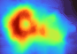
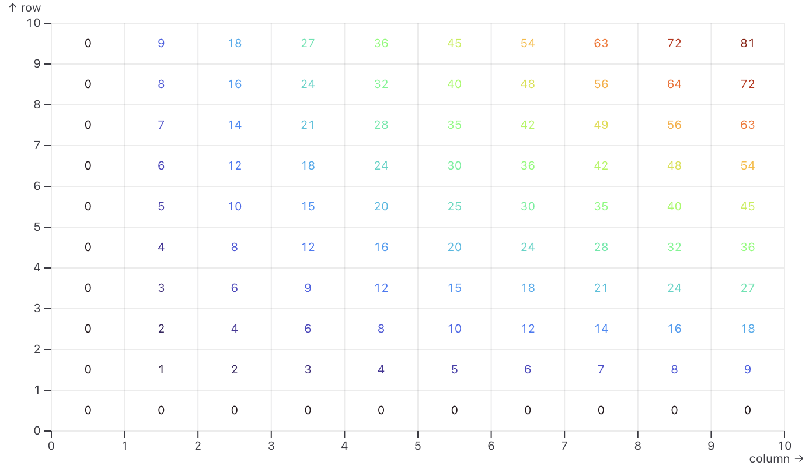
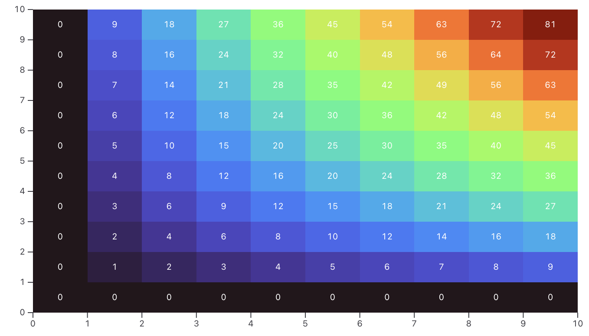
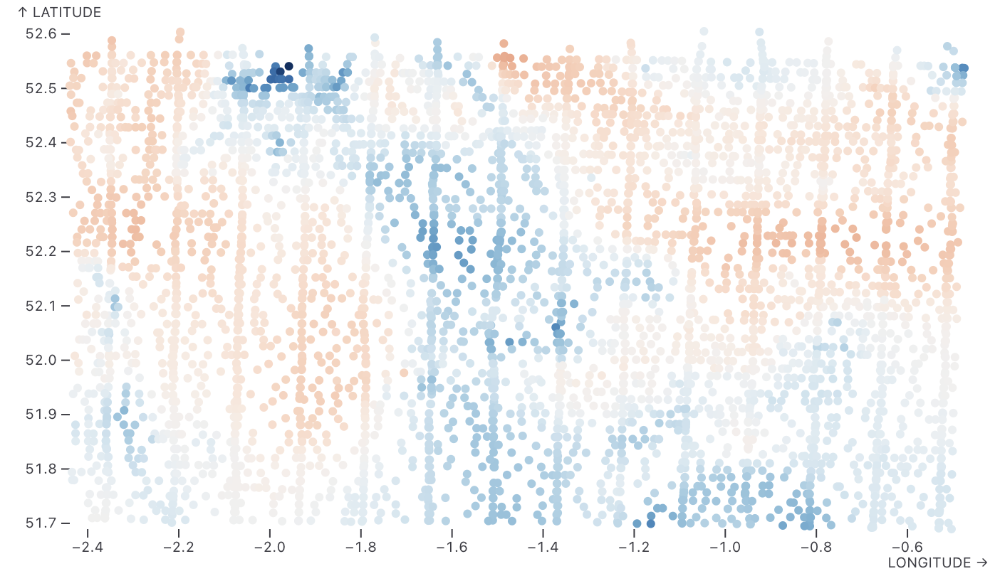
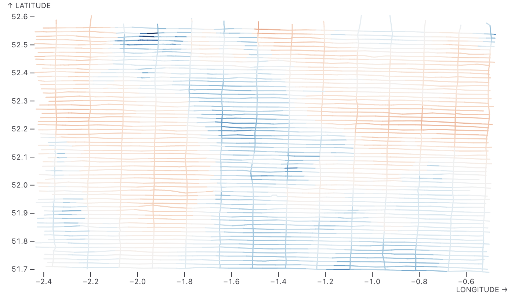
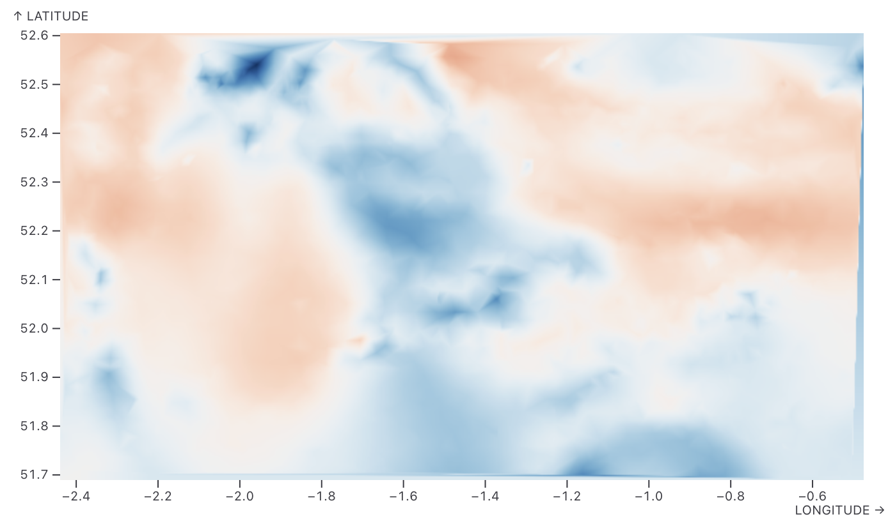
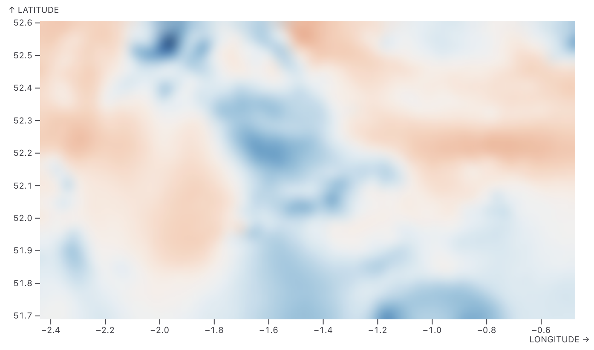
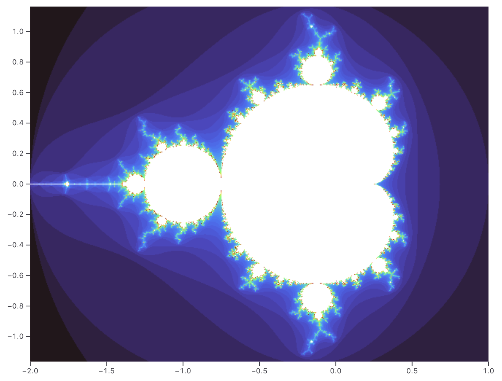
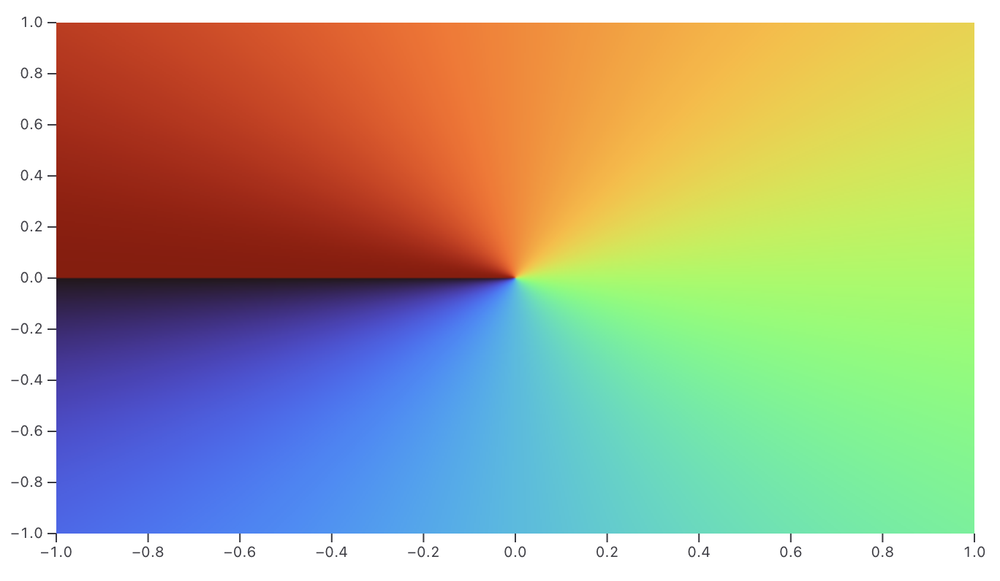
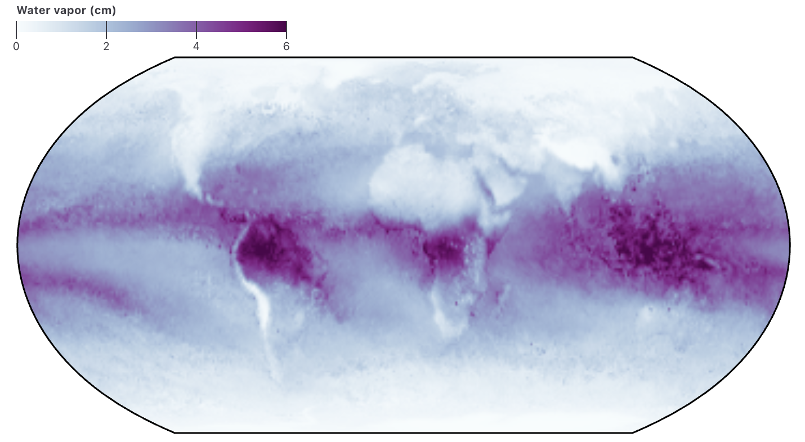

# Raster mark 栅格标记

## TIP

To produce contours instead of a heatmap, see the contour mark.
若需生成等高线而非热力图，请参阅等高线标记。

### 内容

The raster mark renders a raster image — that is, an image formed by discrete pixels in a grid, not a vector graphic like other marks. And whereas the image mark shows an existing image, the raster mark creates one from abstract data, either by interpolating spatial samples (arbitrary points in x and y) or by sampling a function f(x,y) along the grid.
光栅标记渲染光栅图像——即由网格中离散像素构成的图像，而非像其他标记那样的矢量图形。而图像标记展示现有图像时，光栅标记则通过空间样本插值（x和y轴上的任意点）或沿网格采样函数f(x,y)，从抽象数据中生成图像。

For example, the heatmap below shows the topography of the Maungawhau volcano, produced from a 87×61 grid of elevation samples.
例如下图热力图展示了芒加瓦火山的地形，该图基于87×61的网格高程采样点生成。


#### 网格坐标系

The grid (volcano.values above) is a list of numbers [103, 104, 104, …]. The first number 103 is the elevation of the bottom-left corner. This grid is in row-major order, meaning that the elevations of the first row are followed by the second row, then the third, and so on. Here’s a smaller grid to demonstrate the concept.
该网格（上文中的volcano.values）是一个数字列表[103, 104, 104, …]。首项103代表左下角的海拔值。此网格采用行优先顺序，即第一行海拔值后紧接第二行，依次排列。下图展示了更小的网格以说明该概念。

```js
grid = ({
  "width": 10,
  "height": 10,
  "values": [
     0,  0,  0,  0,  0,  0,  0,  0,  0,  0,
     0,  1,  2,  3,  4,  5,  6,  7,  8,  9,
     0,  2,  4,  6,  8, 10, 12, 14, 16, 18,
     0,  3,  6,  9, 12, 15, 18, 21, 24, 27,
     0,  4,  8, 12, 16, 20, 24, 28, 32, 36,
     0,  5, 10, 15, 20, 25, 30, 35, 40, 45,
     0,  6, 12, 18, 24, 30, 36, 42, 48, 54,
     0,  7, 14, 21, 28, 35, 42, 49, 56, 63,
     0,  8, 16, 24, 32, 40, 48, 56, 64, 72,
     0,  9, 18, 27, 36, 45, 54, 63, 72, 81
  ]
})
```

We can visualize this small grid directly with a text mark using the same color encoding. Notice that the image below is flipped vertically relative to the data: the first row of the data is the bottom of the image because below y points up↑.
我们可直接使用文本标记以相同颜色编码可视化该小网格。请注意下图相对于数据存在垂直翻转：数据首行位于图像底部，因为 y 轴指向下方↑。



```js
Plot.plot({
  grid: true,
  x: {domain: [0, grid.width], label: "column"},
  y: {domain: [0, grid.height], label: "row"},
  marks: [
    Plot.text(grid.values, {
      text: Plot.identity,
      fill: Plot.identity,
      x: (d, i) => i % grid.width + 0.5,
      y: (d, i) => Math.floor(i / grid.width) + 0.5
    })
  ]
})
```

Also notice that the grid points are offset by 0.5: they represent the middle of each pixel rather than the corner. Below, the raster mark is laid under the text mark to show the raster image.
另需注意网格点存在0.5偏移：它们代表每个像素的中点而非角落。下图将栅格标记置于文本标记下方以展示栅格图像。


```js
Plot.plot({
  marks: [
    Plot.raster(grid.values, {
      width: grid.width,
      height: grid.height,
      imageRendering: "pixelated" // to better show the grid
    }),
    Plot.text(grid.values, {
      text: Plot.identity,
      fill: "white",
      x: (d, i) => i % grid.width + 0.5,
      y: (d, i) => Math.floor(i / grid.width) + 0.5
    })
  ]
})
```

> CAUTION
> Safari does not currently support the imageRendering option.
> Safari当前不支持imageRendering选项。

#### 离散点数据生成raster mark 示例

> `最近邻插值(nearest interpolator)`：Contour mark 默认插值方法
> 重心插值法(barycentric interpolator)：使用场景如Delaunay marks
> 随机游走插值法(random-walk interpolator)

While the raster mark provides convenient shorthand for strictly gridded data, as above, it also works with samples in arbitrary positions and arbitrary order. For example, in 1955 the Great Britain aeromagnetic survey measured the Earth’s magnetic field by plane. Each sample recorded the longitude and latitude alongside the strength of the IGRF in nanoteslas.
虽然光栅标记为严格网格化数据提供了便捷的简写方式（如上所述），它同样适用于任意位置和任意顺序的采样点。例如，1955年英国航空磁测项目通过飞机测量地球磁场时，每个采样点都记录了经纬度信息，以及国际参考地磁场（IGRF）强度（单位为纳特斯拉）。

Using a dot mark, we can make a quick scatterplot to see the irregular grid. We’ll use a diverging color scale to distinguish positive and negative values.
采用点标记法可快速绘制散点图，直观呈现不规则网格分布。我们将运用发散式色阶区分正负数值。


```js
Plot.line(ca55, {x: "LONGITUDE", y: "LATITUDE", stroke: "MAG_IGRF90", z: "LINE_NUMB-SEG"}).plot({color: {type: "diverging"}})
```

And using a line mark, we can connect the line segments to reveal the flight paths.
若使用线标记，则可连接线段以显现飞行轨迹。


```js
Plot.raster(ca55, {x: "LONGITUDE", y: "LATITUDE", fill: "MAG_IGRF90", interpolate: "nearest"}).plot({color: {type: "diverging"}})
```

The image above starts to be readable, but it would be frustrating to not do more with this data given all the effort that went into collecting it! Fortunately the raster mark’s interpolate option can quickly produce a continuous image.
上图已具可读性，但考虑到数据采集的艰辛付出，若不进一步开发实属可惜！所幸栅格标记的插值功能可快速生成连续图像。

The nearest interpolator assigns the value of each pixel in the grid using the nearest sample in the data. In effect, this produces a Voronoi diagram.
最近点插值法通过数据中最近的样本值为网格每个像素赋值，实质上生成了一幅沃罗诺伊图。


```js
Plot.raster(ca55, {x: "LONGITUDE", y: "LATITUDE", fill: "MAG_IGRF90", interpolate: "nearest"}).plot({color: {type: "diverging"}})
```

> TIP
> You can also make this Voronoi diagram with the voronoi mark.
> 您亦可通过Voronoi标记生成该Voronoi图。

If the observed phenomenon is continuous, we can use the barycentric interpolator. This constructs a Delaunay triangulation of the samples, and then paints each triangle by interpolating the values of the triangle’s vertices in barycentric coordinates. (Points outside the convex hull are extrapolated.)
若观测现象呈连续分布，可采用重心插值法。该方法通过构建样本的德劳内三角剖分，再根据三角形顶点的重心坐标插值填充每个三角形区域（凸包外点数据进行外推）。
<!-- 有效完整示例。 -->


```js
Plot.raster(ca55, {x: "LONGITUDE", y: "LATITUDE", fill: "MAG_IGRF90", interpolate: "barycentric"}).plot({color: {type: "diverging"}})
```

#### 其他插值方法

Finally, the random-walk interpolator assigns the value at each grid location simply by taking a random walk that stops after reaching a minimum distance from any sample! The interpolator uses the walk on spheres algorithm, limited to 2 consecutive jumps.
最后，随机游走插值器通过执行随机游走来分配每个网格位置的值——当游走路径距离任何样本点达到最小距离时即停止！该插值器采用球面游走算法，且限制为最多连续跳跃两次。


```js
Plot.raster(ca55, {x: "LONGITUDE", y: "LATITUDE", fill: "MAG_IGRF90", interpolate: "random-walk"}).plot({color: {type: "diverging"}})
```

With the random-walk method, the image is grainy, reflecting the uncertainty of the random walk. Use the blur option to make it smoother.
采用随机游走方法时，图像会呈现颗粒感，这反映了随机游走的不确定性。可使用模糊选项使其更平滑。


```js
Plot.raster(ca55, {x: "LONGITUDE", y: "LATITUDE", fill: "MAG_IGRF90", interpolate: "random-walk", blur: 5}).plot({color: {type: "diverging"}})
```

> TIP
> If none of the built-in spatial interpolators suffice, you can write your own as a custom function!
> 若内置空间插值器均无法满足需求，您可编写自定义函数实现专属插值方案！

#### 分割线

The raster mark can interpolate categorical values, too! Below, this creates an interesting “map” of penguin species in the space of culmen length vs. depth.
光栅标记也能对分类变量进行插值！下图展示了企鹅物种在喙长与深度空间中的有趣分布图。


```js
Plot.plot({
  color: {legend: true},
  marks: [
    Plot.raster(penguins, {x: "culmen_length_mm", y: "culmen_depth_mm", fill: "species", interpolate: "random-walk"}),
    Plot.dot(penguins, {x: "culmen_length_mm", y: "culmen_depth_mm"})
  ]
})
```

As an alternative to interpolating discrete samples, you can supply values as a continuous function f(x,y); the raster mark will invoke this function for the midpoint of each pixel in the raster grid, similar to a WebGL fragment shader. For example, below we visualize the Mandelbrot set by counting the number of iterations needed until the point “escapes”.
除了对离散样本进行插值外，您还可以提供连续函数 f(x,y) 作为值；栅格标记将对栅格网格中每个像素的中点调用此函数，类似于 WebGL 片段着色器。例如，下图通过统计点达到“逃逸”状态所需的迭代次数，可视化了曼德布罗集。


```js
Plot.raster({fill: mandelbrot, x1: -2, x2: 1, y1: -1.164, y2: 1.164}).plot({aspectRatio: 1})

function mandelbrot(x, y) {
  for (let n = 0, zr = 0, zi = 0; n < 80; ++n) {
    [zr, zi] = [zr * zr - zi * zi + x, 2 * zr * zi + y];
    if (zr * zr + zi * zi > 4) return n;
  }
}
```

Or to visualize the arctangent function:
或可视化反正切函数：


```js
Plot.raster({x1: -1, x2: 1, y1: -1, y2: 1, fill: (x, y) => Math.atan2(y, x)}).plot()
```

> TIP
> When faceting, the sample function f(x,y) is passed a third argument of the facet values {fx, fy}.
> 进行多面体可视化时，采样函数 f(x,y) 会接收第三个参数——多面体值 {fx, fy}。

#### 投影支持

The raster mark supports Plot’s projection system. The chart below shows global atmospheric water vapor measurements from NASA Earth Observations.
光栅标记支持Plot的投影系统。下图展示了来自美国宇航局地球观测的数据，呈现全球大气水蒸气测量结果。


```js
Plot.plot({
  projection: "equal-earth",
  color: {
    scheme: "BuPu",
    domain: [0, 6],
    legend: true,
    label: "Water vapor (cm)"
  },
  marks: [
    Plot.raster(vapor, {
      fill: Plot.identity,
      width: 360,
      height: 180,
      x1: -180,
      y1: 90,
      x2: 180,
      y2: -90,
      interpolate: "barycentric",
      clip: "sphere"
    }),
    Plot.sphere({stroke: "black"})
  ]
})
```

### **Raster options**

If data is provided, it represents discrete samples in abstract coordinates x and y; the fill and fillOpacity channels specify further abstract values (e.g., height in a topographic map) to be spatially interpolated to produce an image.
若提供数据，则表示抽象坐标系x和y中的离散样本；填充和填充不透明度通道指定了需进行空间插值以生成图像的进一步抽象值（例如地形图中的高度）。

```js
Plot.raster(volcano.values, {width: volcano.width, height: volcano.height})
```

The fill and fillOpacity channels may alternatively be specified as continuous functions f(x,y) to be evaluated at each pixel centroid of the raster grid (without interpolation).
填充和填充不透明度通道也可指定为连续函数f(x,y)，该函数将在光栅网格的每个像素质心处进行评估（无需插值）。

```js
Plot.raster({x1: -1, x2: 1, y1: -1, y2: 1, fill: (x, y) => Math.atan2(y, x)})
```

The resolution of the rectangular raster image may be specified with the following options:
矩形光栅图像的分辨率可通过以下选项指定：

- **width** - the number of pixels on each horizontal line
- 每条水平线上的像素数量
- **height** - the number of lines; a positive integer

The raster dimensions may also be imputed from the extent of x and y and a pixel size:
光栅尺寸也可根据x和y范围及像素尺寸推算：

- **x1** - the starting horizontal position; bound to the x scale
- **x2** - the ending horizontal position; bound to the x scale
- **y1** - the starting vertical position; bound to the y scale
- **y2** - the ending vertical position; bound to the y scale
- **pixelSize** - the screen size of a raster pixel; defaults to 1

- x1 - 起始水平位置；受x尺度限制
- x2 - 终止水平位置；受x尺度限制
- y1 - 起始垂直位置；受y尺度限制
- y2 - 终止垂直位置；受y尺度限制
- pixelSize - 光栅像素的屏幕尺寸；默认值为1

If width is specified, x1 defaults to 0 and x2 defaults to width; likewise, if height is specified, y1 defaults to 0 and y2 defaults to height. Otherwise, if data is specified, x1, y1, x2, and y2 respectively default to the frame’s left, top, right, and bottom coordinates. Lastly, if data is not specified (as when fill or fillOpacity is a function of x and y), you must specify all of x1, x2, y1, and y2 to define the raster domain (see below). The pixelSize may be set to the inverse of the devicePixelRatio for a sharper image.
若指定宽度，则 x1 默认为 0，x2 默认为宽度；同理，若指定高度，则 y1 默认为 0，y2 默认为高度。否则，若指定数据，则 x1、y1、x2 和 y2 分别默认为帧的左、上、右、下坐标。最后，若未指定数据（例如填充或填充不透明度取决于x和y时），必须同时指定x1、x2、y1和y2以定义光栅域（详见下文）。可将像素尺寸设为设备像素比的倒数以获得更清晰的图像。

The following raster-specific constant options are supported:
支持以下光栅专属常量选项：

- **interpolate** - the spatial interpolation method
- **imageRendering** - the image-rendering attribute; defaults to auto (bilinear)
- **blur** - a non-negative pixel radius for smoothing; defaults to 0
The imageRendering option may be set to pixelated for a sharper image. The interpolate option is ignored when fill or fillOpacity is a function of x and y.

- interpolate - 空间插值方法
- imageRendering - 图像渲染属性；默认为auto（双线性插值）
- blur - 用于平滑处理的非负像素半径；默认为0

imageRendering选项可设为pixelated以获得更锐利的图像。当fill或fillOpacity为x和y的函数时，interpolate选项将被忽略。

**Spatial interpolators** 空间插值器

The raster and contour marks use spatial interpolators to populate a raster grid from a discrete set of (often ungridded) spatial samples. The interpolate option controls how these marks compute the raster grid. The following built-in methods are provided:
栅格和等值线标记使用空间插值器，从离散的空间样本集（通常未栅格化）填充栅格网格。插值选项控制这些标记如何计算栅格网格。提供以下内置方法：

- none (or null) - assign each sample to the containing pixel
- nearest - assign each pixel to the closest sample’s value (Voronoi diagram)
- barycentric - apply barycentric interpolation over the Delaunay triangulation
- random-walk - apply a random walk from each pixel, stopping when near a sample

none（或 null）- 将每个样本分配给包含它的像素
nearest - 将每个像素分配给最近样本的值（Voronoi 图）
barycentric - 在Delaunay三角剖分上应用重心插值
random-walk - 从每个像素开始随机游走，接近样本时停止

The interpolate option can also be specified as a function with the following arguments:
插值选项也可通过函数形式指定，参数如下：

- index - an array of numeric indexes into the channels x, y, value
- width - the width of the raster grid; a positive integer
- height - the height of the raster grid; a positive integer
- x - an array of values representing the x-position of samples
- y - an array of values representing the y-position of samples
- value - an array of values representing the sample’s observed value

index - 数值索引数组，指向通道 x、y、value
width - 栅格网格宽度；正整数
height - 栅格网格高度；正整数
x - 数组，表示样本的 x 位置
y - 表示样本 y 坐标的数组
value - 表示样本观测值的数组

So, x[index[0]] represents the x-position of the first sample, y[index[0]] its y-position, and value[index[0]] its value (e.g., the observed height for a topographic map).
因此，x[index[0]] 表示首个样本的 x 坐标，y[index[0]] 表示其 y 坐标，value[index[0]] 表示其观测值（例如地形图中的观测高度）。
